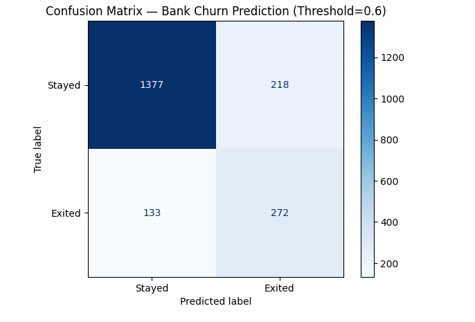
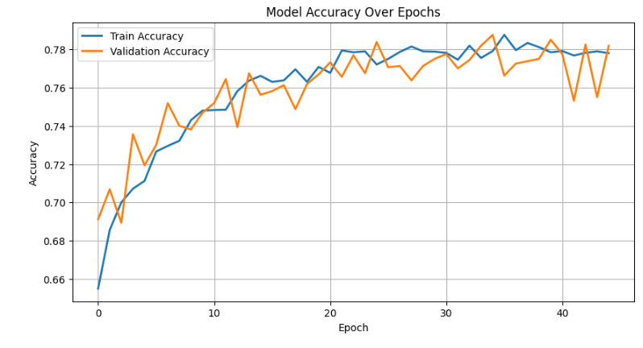
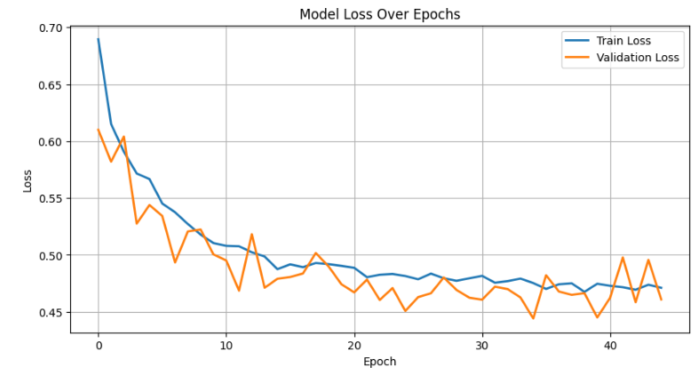

# 📘 Bank Churn Prediction using Optimized ANN

This project aims to **predict customer churn** in a bank using an **optimized Artificial Neural Network (ANN)**. The dataset used is available on [Kaggle](https://www.kaggle.com/datasets/filippoo/deep-learning-az-ann).

---

## 📂 Project Structure

- `bankexit.pynb` : Complete notebook with the optimized ANN code.  
- `images/` : Folder containing screenshots (confusion matrix, loss, accuracy).  
- `README.md` : Project description.  

---

## ⚙️ Requirements

- Python >= 3.8  
- Libraries:  
  - `numpy`  
  - `pandas`  
  - `matplotlib`  
  - `scikit-learn`  
  - `keras` / `tensorflow`
    
---

## 📝 Code Overview

### 1. Data Loading and Preparation
- Load dataset and inspect for missing values.  
- Encode categorical columns (`Geography`, `Gender`) using `LabelEncoder`.  
- Split data into **train/test sets (80/20)**.  
- Apply **feature scaling** using `StandardScaler`.

---

### 2. Handling Class Imbalance
- Compute **class weights** to handle the smaller number of churned customers.

---

### 3. Building the ANN
- **Architecture:** 3 hidden layers with `ReLU` activation and `he_uniform` initializer.  
- **Regularization:** Dropout of 0.2 to prevent overfitting.  
- **Output Layer:** Sigmoid activation for binary classification.  
- **Optimizer:** Adam  
- **Loss Function:** Binary cross-entropy  

---

### 4. Training
- **EarlyStopping** on validation loss (`patience = 10`).  
- **Batch size:** 16  
- **Epochs:** 100 (or until early stopping triggers)

---

### 5. Evaluation
- **Metrics:** Accuracy, classification report, confusion matrix.  
- **Visualization:** Plot accuracy and loss curves.

---

### 6. Example Prediction
- Predict churn for a sample customer using an adjusted threshold (`threshold = 0.6`).

---

## 📊 Results

### 🔹 Confusion Matrix

---

### 🔹 Accuracy Curve

---

### 🔹 Loss Curve

---

## 📈 Conclusion

The optimized ANN predicts churn effectively with good overall accuracy.

Using class_weights and adjusting the threshold improves detection of at-risk customers.

This notebook can serve as a foundation for supervised machine learning projects on banking data.

---

🔗 Dataset
Churn Modelling Dataset on Kaggle
